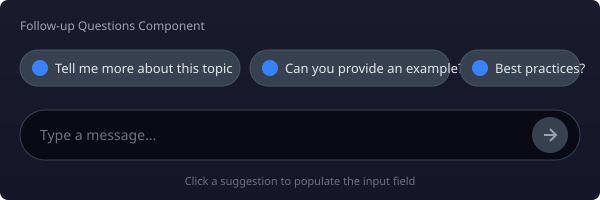
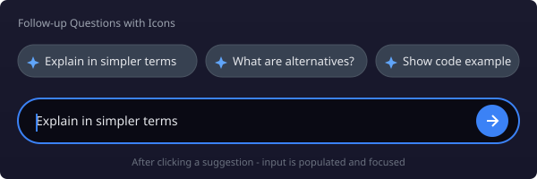
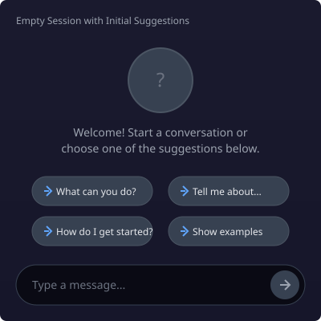

# FollowUpQuestions Component

A component for displaying clickable follow-up question suggestions in chat interfaces. When clicked, suggestions populate the chat input and focus it for immediate sending.

## Screenshots

### Basic Usage


### With Icons


### Empty Session with Initial Suggestions


## Installation

The component is included in the `reachat` package:

```bash
npm install reachat
```

## Usage

### Basic Usage

```tsx
import { FollowUpQuestions, FollowUp } from 'reachat';

const questions: FollowUp[] = [
  { id: '1', question: 'Tell me more about this topic' },
  { id: '2', question: 'Can you provide an example?' },
  { id: '3', question: 'What are the best practices?' }
];

// Inside your Chat component
<FollowUpQuestions questions={questions} />
```

### With Icons

```tsx
import SparklesIcon from './sparkles.svg?react';

<FollowUpQuestions
  questions={questions}
  icon={<SparklesIcon />}
/>
```

### With Click Callback

```tsx
<FollowUpQuestions
  questions={questions}
  onQuestionClick={(question) => {
    console.log('User clicked:', question);
    // Track analytics, etc.
  }}
/>
```

### Custom Rendering

```tsx
const CustomItem = ({ question, onClick }) => (
  <button
    className="custom-button"
    onClick={() => onClick?.(question)}
  >
    {question}
  </button>
);

<FollowUpQuestions questions={questions}>
  <CustomItem />
</FollowUpQuestions>
```

## Props

| Prop | Type | Description |
|------|------|-------------|
| `questions` | `FollowUp[]` | Array of follow-up questions to display |
| `icon` | `ReactElement` | Optional icon to display for each question |
| `className` | `string` | Custom class name for the container |
| `onQuestionClick` | `(question: string) => void` | Callback when a question is clicked |
| `children` | `ReactElement` | Custom component for rendering each item |

### FollowUp Interface

```typescript
interface FollowUp {
  id: string;      // Unique identifier
  question: string; // Display text for the follow-up
}
```

## Theming

The component uses the theme system. Customize styles via:

```typescript
const customTheme = {
  followUpQuestions: {
    base: 'flex flex-wrap gap-2 mt-4',
    item: {
      base: 'flex items-center gap-2 px-4 py-2 rounded-full border...',
      icon: 'w-4 h-4 text-blue-500',
      text: 'text-sm'
    }
  }
};
```

## Storybook Stories

Run Storybook to see all examples:

```bash
npm run storybook
```

Available stories:
- **Basic** - Simple usage with default styling
- **WithIcons** - Questions with sparkles icon
- **EmptySession** - Initial questions shown before any conversation
- **Companion** - Compact view for smaller screens
- **CustomItemRendering** - Custom styled buttons
- **DynamicFollowUps** - Questions that change based on conversation context
